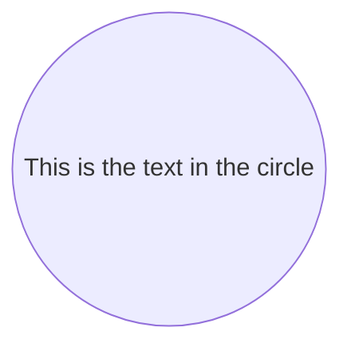
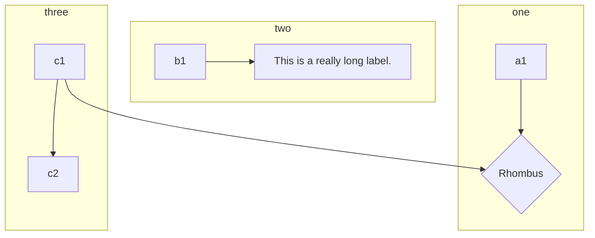

# WelcomeToSmartdown
---

## Welcome to Smartdown

Smartdown an extension of Markdown that includes several additions:
- The ability to have input, output, and calculation *cells* that react to user input. Smartdown's cells are similar to those in most spreadsheets.
- Additional media embedding support including Tweets, SVG, Video.
- Integration of [P5JS](https://p5js.org)
- Integration of [plotly.js](https://plot.ly/javascript/)
- Much Much more


### Map of functionality

Use the navigation buttons below to explore different aspects of Smartdown.

- [SVG](:@SVG)
- [Math](:@Math)
- [Mermaid](:@Mermaid)
- [Cells](:@Cells)
- [Plotly](:@Plotly)


[Smartdown Tour](:@raw/SmartdownTour/)
[Welcome To My Blog](:@raw/WelcomeToMyBlog/)

### GIF Example

I'm experimenting with incorporating GIFs for the purpose of building a tutorial.


# SVG
---

Smartdown allows SVG images to be registered and preprocessd so that they can be dynamically styled. For this example, we incorporate an SVG from [Wikimedia Hypercube](https://commons.wikimedia.org/wiki/File:Hypercube.svg).

We can use ordinary Markdown image syntax:


Or, we can use Smartdowns `/media` syntax and amend it with styling:

|hypercube|pulse|clockwise|cclockwise|bluegreen|
|:---:|:---:|:---:|:---:|:---:|
||||||
||||||

---

[Back to Home](:@WelcomeToSmartdown)


# Math
---

#### Math Example

By using MathJax, we can display all sorts of notation.

We can do inline math: $E = mc^2$

$\displaystyle E = mc^2$


Or we can do block math:

$$
A \longrightarrow B
$$

$$
\begin{array}{c|lcr}
n & \text{Left} & \text{Center} & \text{Right} \\
\hline
1 & 0.24 & 1 & 125 \\
2 & -1 & 189 & -8 \\
3 & -20 & 2000 & 1+10i
\end{array}
$$

And even diagrams via *xyjax*:

$$
\begin{xy}
0;<1em,0em>:
(1,1);p+/v a(18) 5.5em/**@{-},
(1,3);p+/v a(18) 5.5em/**@2{-},
(1,5);p+/v a(18) 5.5em/**@3{-},
(1,9);p+/v a(18) 5.5em/**@{.},
(1,11);p+/v a(18) 5.5em/**@2{.},
(1,13);p+/v a(18) 5.5em/**@3{..},
\end{xy}
$$

---

[Back to Home](:@WelcomeToSmartdown)


# Mermaid
---



---




We can do inline math: $E = mc^2$

---

[Back to Home](:@WelcomeToSmartdown)


# Cells
---

### External Data Query

*The Smartdown code below is a work in progress and the syntax used is experimental and in flux.*

One of the goals of Smartdown is to enable simple text files to express rich interactive experiences that involve live data. Ideally, web-based services would already exist to serve the data-hunger of Smartdown. In this example, we are exploring the use of [Wikidata](https://www.wikidata.org) as a data source.

Limitations of the current tech include:

- The [Falcor](https://netflix.github.io/falcor/) syntax is a hack and is not using the Falcor library.
- The current example emphasizes the extraction of thumbnail images from Wikidata and does not display or utilize the full set of metadata returned.

[Who do you want to look up?](:?WHO)

[Lookup Name via slash](:=LOOKUP=/wikidata/Albert Einstein|Albert Ellis|Albert Estopinal)
[Lookup Name via Falcor](:=LOOKUP=/wikidata["Albert Einstein"])
[Lookup Name via WHO variable](:=LOOKUP=/wikidata[`WHO`])
[Lookup result](:!LOOKUP)

---

[Back to Home](:@WelcomeToSmartdown)


# Plotly
---

## Plotly.js Experiments

The current integration of [plotly.js](https://plot.ly/javascript/) is fairly raw, and you may encounter problems with autolayout/sizing as well as other features I haven't tested or fixed.

### Hello World

Here is the [Hello World](https://plot.ly/javascript/getting-started/#hello-world-example) example.

This example enables the user to enter an alternate Title, which is associated with the variable `PLOT_TITLE`. Smartdown's Plotly integration is still in its initial stages, with the plot title being adjustable by changing the `PLOT_TITLE` variable. Eventually, it will be possible to have plots respect arbitrary smartdown variable data, instead of just the special `PLOT_TITLE` variables.

---

[Title](:?PLOT_TITLE)

---

```plotly
var layout = {
    title: 'Default Title',
    autosize: true,
    // width: 500,
    // height: 300,
    margin: {
      t: 100, b: 0, l: 0, r: 0
    }
};

Plotly.plot( this.div, [{
    x: [1, 2, 3, 4, 5],
    y: [1, 2, 4, 8, 16] }], layout,
    {displayModeBar: true} );

```


### 3D Surface Plots

From [3D Surface Plots](https://plot.ly/javascript/3d-surface-plots/)


```plotly

var myDiv = this.div;
Plotly.d3.csv('https://raw.githubusercontent.com/plotly/datasets/master/api_docs/mt_bruno_elevation.csv', function(err, rows){
  function unpack(rows, key) {
    return rows.map(function(row) { return row[key]; });
  }

  var z_data=[ ]
  for(i=0;i<24;i++)
  {
    z_data.push(unpack(rows,i));
  }

  var data = [{
             z: z_data,
             type: 'surface'
          }];

  var layout = {
    title: 'Mt Bruno Elevation',
    autosize: true,
    // width: 500,
    // height: 300,
    margin: {
      t: 100, b: 0, l: 0, r: 0
    }
  };
  Plotly.newPlot(myDiv, data, layout, {displayModeBar: true});
});


```


### Simple Contour Plot

```plotly
var myDiv = this.div;

var size = 100, x = new Array(size), y = new Array(size), z = new Array(size), i, j;

for(var i = 0; i < size; i++) {
  x[i] = y[i] = -2 * Math.PI + 4 * Math.PI * i / size;
    z[i] = new Array(size);
}

for(var i = 0; i < size; i++) {
    for(j = 0; j < size; j++) {
      var r2 = x[i]*x[i] + y[j]*y[j];
      z[i][j] = Math.sin(x[i]) * Math.cos(y[j]) * Math.sin(r2) / Math.log(r2+1);
  }
}

var data = [ {
    z: z,
    x: x,
    y: y,
    type: 'contour'
  }
];

  var layout = {
    title: 'Simple Contour Plot',
    autosize: true,
    // width: 500,
    // height: 300,
    margin: {
      t: 100, b: 0, l: 0, r: 0
    }
  };

Plotly.newPlot(myDiv, data, layout, {displayModeBar: true});
```


### Maps

From [Chloropleth Map](https://plot.ly/javascript/choropleth-maps)


```plotly

var myDiv = this.div;
Plotly.d3.csv(
  'https://raw.githubusercontent.com/plotly/datasets/master/2010_alcohol_consumption_by_country.csv',
  function(err, rows) {
    function unpack(rows, key) {
      return rows.map(function(row) { return row[key]; });
    }

    var data = [{
      type: 'choropleth',
      locationmode: 'country names',
      locations: unpack(rows, 'location'),
      z: unpack(rows, 'alcohol'),
      text: unpack(rows, 'location'),
      autocolorscale: true
    }];

    var layout = {
      autosize: true,
      title: 'Pure alcohol consumption among adults (age 15+) in 2010',
      geo: {
        projection: {
          type: 'robinson'
        }
      }
    };

    Plotly.plot(myDiv, data, layout, {showLink: false, displayModeBar: true});
  });

```

---

[Back to Home](:@WelcomeToSmartdown)
